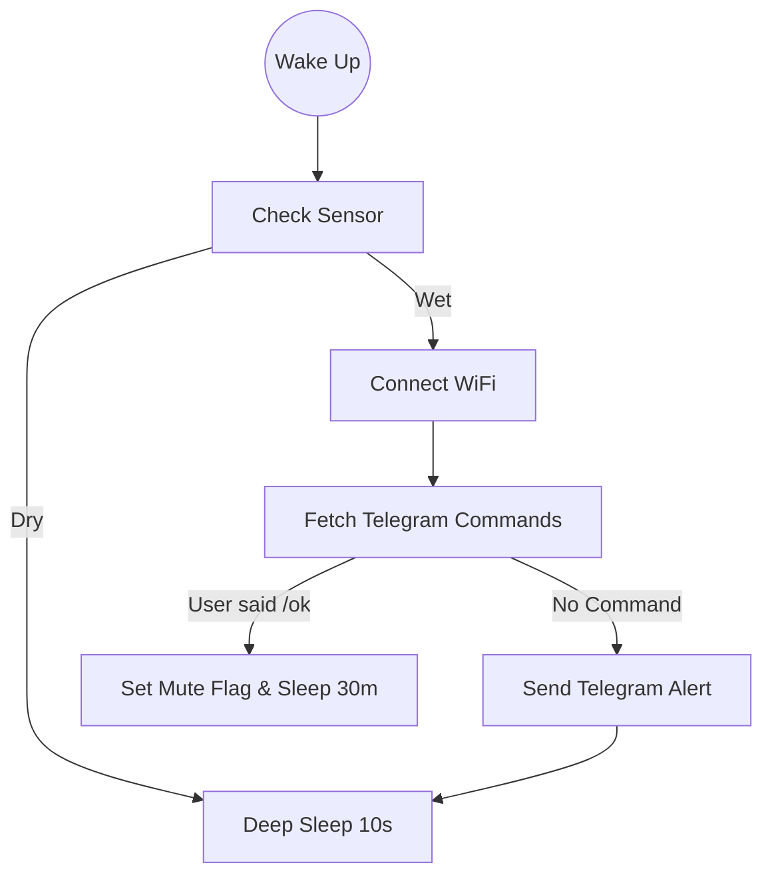

# Vroxoulis The Little Rainy Man

An autonomous, ultra-low-power IoT agent that protects laundry from unpredictable weather.

## The Problem

In Thessaloniki, the weather is notoriously bipolar. I frequently faced a domestic inefficiency: hanging laundry to dry, getting distracted by work, and realizing too late that a sudden rainstorm had soaked the clothes.

## The Solution

Vroxoulis is a "set-and-forget" guardian that notifies me when action is required, with zero maintenance for months. A standalone IoT device powered by an ESP32-C3 microcontroller, it sits on the balcony rail and monitors environmental moisture.

Upon detecting rain, it utilizes the Telegram Bot API to send a push notification directly to my phone. It features a "Snooze" logic to prevent alert fatigue.

## System Architecture

The Hardware Stack

- MCU: ESP32-C3 Super Mini (Chosen for RISC-V low power consumption).

- Sensor: Resistive Rain Sensor Module.

- Power: 18650 Li-Ion Battery + TP4056 Charger.

- Protection: Waterproof Junction Box with hot-glue light pipes for status LEDs.

The Wiring

The Logic Pipeline

The system operates on an extreme duty cycle to maximize battery life. It spends 99.9% of its life in Deep Sleep.

## Engineering & Optimization

Deep Sleep Strategy: The device does not idle; it shuts down completely. RAM is volatile, so I utilized RTC Memory (Slow Memory) to persist state (Mute flags, Message IDs) across sleep cycles.

Sensor Electrolysis Prevention: Resistive sensors corrode if powered constantly. The code powers the sensor rail via a GPIO pin for only 100ms during measurement, extending sensor life by years.

The "Amnesia" Fix: Implemented a logic flush to handle Telegram's message offset, ensuring the device doesn't re-read old "stop" commands upon waking.

## Usage

Clone the Repo:

git clone [https://github.com/n-laoutaris/vroxoulis.git](https://github.com/n-laoutaris/vroxoulis.git)

Configure Secrets:
Rename src/secrets.example.h to src/secrets.h and add your WiFi/Telegram credentials.

Select Board:
In platformio.ini, choose your environment:

env:vroxoulis_c3 (For Super Mini)

env:vroxoulis_original (For DevKit V1)

Flash:
Upload via USB.

## Future Work

Data Logging: Integrate InfluxDB to log rain duration and frequency in Thessaloniki, comparing local sensor data with OpenWeatherMap API predictions.

Predictive Alerting: Use the pressure sensor (BMP280) to predict rain before the sensor gets wet based on barometric drops.

Solar Autonomy: Add a small 5V solar panel to the TP4056 input for infinite runtime.

Built with ❤️ (and dry socks).
