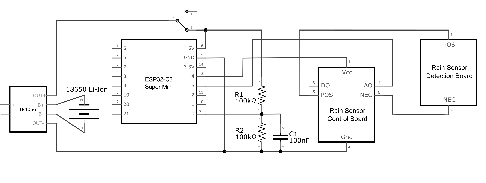
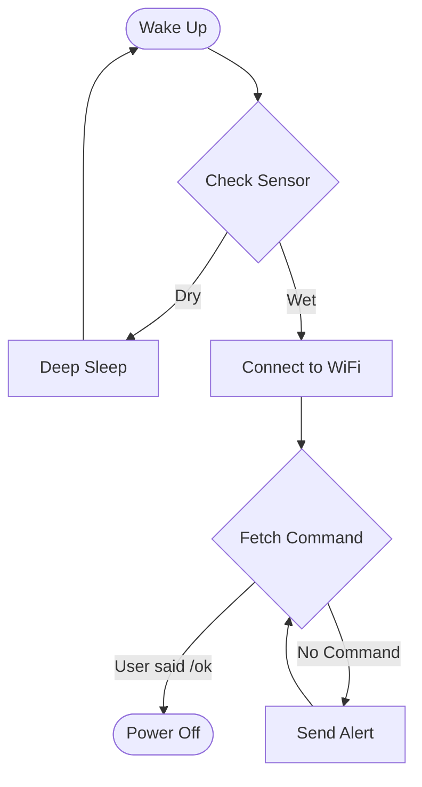

# Vroxoulis The Little Rainy Man

An autonomous, ultra-low-power IoT agent that protects laundry from unpredictable weather.

## The Problem

In Thessaloniki, the weather is notoriously bipolar. I frequently faced a domestic inefficiency: hanging laundry to dry, getting distracted by work, and realizing too late that a sudden rainstorm had soaked the clothes.

## The Solution

Vroxoulis is a "set-and-forget" guardian that notifies me when action is required, with zero maintenance for months. A standalone IoT device powered by an ESP32-C3 microcontroller, it sits on the balcony rail and monitors environmental moisture.

Upon detecting rain, it utilizes the Telegram Bot API to send a push notification directly to my phone. It features a "Snooze" logic to prevent alert fatigue.

## Hardware Stack

- MCU: ESP32-C3 Super Mini (Chosen for RISC-V low power consumption).
- Sensor: Resistive Rain Sensor Module.
- Power: 18650 Li-Ion Battery + TP4056 Charger.

## System Architecture

The system operates on an extreme duty cycle to maximize battery life. It spends 99.9% of its life in Deep Sleep.

I also implemented the following optimizations: 

- Deep Sleep Strategy: RAM is volatile, so I use RTC Memory (Slow Memory) to persist state (Mute flags, Message IDs) across sleep cycles.
- Sensor Electrolysis Prevention: Resistive sensors corrode if powered constantly. The code powers the sensor rail via a GPIO pin for only 100ms during measurement, extending sensor life by years.

## Future Work

- Battery Measurement: Code an additional functinality to self-report battery percentage on start, on command and on reaching critical levels.
- Predictive Behaviour: Fetch OpenWeatherMap API data to increase or decrease sampling rate based on risk of rain.
- Local Weather Monitoring: Use a pressure sensor (BMP280) to corrwlate barometric drops with API predictions.

---

Built with ❤️ (and dry socks).
